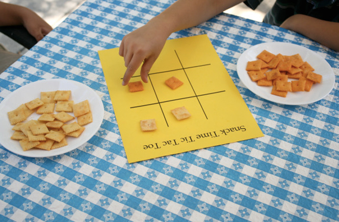

-------------

### Introduction : Présentation de l'équipe
- Audrey (@audreycouture)
- Jerome (@Jerome)
- Damien (@damien13005)
- Maxime (@Maxime)
- Sam 	(@sam)

-------------

Le tic-tac-toe, aussi appelé « morpion » (par analogie au jeu de morpion), est un jeu de réflexion se pratiquant à deux joueurs au tour par tour dont le but est de créer le premier un alignement.
Le jeu se joue généralement avec papier et crayon.
Deux joueurs s'affrontent. Ils doivent remplir chacun à leur tour une case de la grille avec le symbole qui leur est attribué : O ou X. 
Le gagnant est celui qui arrive à aligner trois symboles identiques, horizontalement, verticalement ou en diagonale.

------------

### But de l´exercice

Voici les règles du programme :

le programme est à deux joueurs only (pas d'intelligence artificielle)
le programme doit commencer en demandant le prénom des joueurs
le programme doit afficher le plateau chaque tour (dans le terminal), puis demander au joueur auquel c'est le tour où ce dernier compte jouer
si un joueur gagne, le programme doit annoncer qui a gagné
s'il y a match nul, le programme doit annoncer qu'il y a match nul

Merci pour la correction ! 

# morpion
